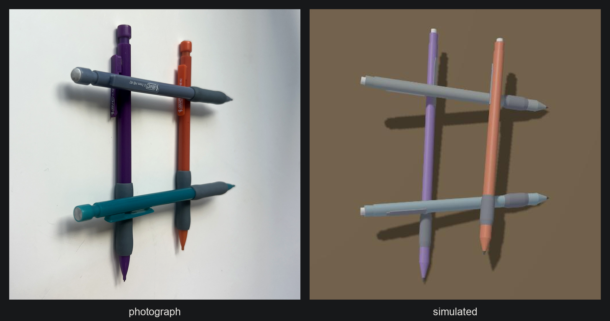

# PhysSplat



**A photo of everyday objects in. Interactive, learned 3D physics in your browser out.**

### [Open the live demo →](https://physsplat.vercel.app)

Drag a pencil to grab it, flick to poke, scroll or drag empty space to orbit.
Every physics step runs client-side; there is no server in the loop.

[](https://physsplat.vercel.app)
[](pyproject.toml)
[](web/public/js)
[](LICENSE)

PhysSplat turns a single photograph of simple objects on a flat surface (pencils
today; the pipeline is object-agnostic) into a fully interactive 3D simulation.
The scene is reconstructed to 3D, decomposed into rigid bodies without
supervision, and simulated in the browser. Two engines share one interface: a
rigid-body solver ([Rapier](https://github.com/dimforge/rapier), Rust compiled
to WebAssembly), which is the default, and a graph neural network trained
entirely on synthetic data with no hand-coded collision solver, behind
`?engine=gnn`. You orbit the scene, grab and poke objects with the mouse, and
watch them slide, pivot, and topple.

```
photo ──► single-image 3D ──► unsupervised object ──► rigid-body   ──► interactive
.jpg      reconstruction      decomposition           solver, or GNN  three.js demo
          (TripoSR)           + particle sampler      (per body)      custom WebGPU
          └────────── once, per scene ──────────┘     └─ every frame, in-browser ─┘
```

## Two engines, and why the solver ships by default

The research question was whether a learned simulator could carry a photo of
real objects into a plausible interactive scene, and the answer is: partly.
Eight blind review rounds and three rounds of player reports went into fencing
the learned model's failure modes with analytic rules (free flight, pivoting,
settling, seating, stiction, swept collision, held-body caps), each measured
and each earning its place, and the pencils still did not lie flat, still
hovered, still twitched. The one change that came out of that work, making
every pencil one canonical shape, is also what made a classical solver usable:
there was finally a clean collider to give it. Measured on the same
sensor-driven checks, all four scenes:

| behaviour | learned model + rules | Rapier |
|---|---|---|
| lone pencil dropped on the desk | pinned wherever it stopped, up to 5° | lies at 0.5° on its grip |
| holding a pencil still at its centre | 3 to 35° of tilt, up to 13.8 rad/s | 0.2 to 3.8°, 0.04 to 0.40 rad/s |
| end grab lifted clear | dangles | dangles, 90.0° |
| resting gap to what a pencil sits on | 0.0 mm after a seating rule | 0.0 mm |
| 250 mm drop onto the pile, worst overlap | 0.1 to 3.4 mm | 0.1 to 1.0 mm |
| cost per 1/60 s step | 15 to 33 ms (WebGPU) | 0.5 ms (WASM) |

The learned model remains in the repo, in the paper, and in the demo, because
the comparison is the interesting result. See `web/public/js/rapier_sim.js`
for what the solver taught in turn: a truly round pencil rolls off a pile at a
nudge (the clip is a collider now, standing proud as the real one does), plastic
on plastic is nearer 0.28 than 0.42, and an impact at 2.2 m/s needs 16 substeps
a frame not to sink into the pile.

## The interface

The page is a sandbox, not a viewer. The top bar picks a scene from photo
thumbnails and shows which engine is running; the dock on the right has five
tabs:

| tab | what it holds |
|---|---|
| Play | speed (0.1× to 1× slow motion, real physics at a smaller step rate), reset, drop a new pencil, lift one, pull the load-bearing one; grab strength and follow speed |
| Camera | views: home, top, side, low (desk level), and **photo**, the viewpoint the picture was taken from; follow a pencil; auto-orbit; field of view; a live readout |
| Physics | gravity, pencil-on-pencil and pencil-on-desk friction, bounciness, all live; the defaults are the values that matched real pencils on the sensor checks |
| Display | the photographed desk, **compare with the real photo** (the original photograph under the simulated pencils), shadows, filmic tone mapping; overlays for labels, contact points, velocity arrows and collider outlines |
| Sensors | the live sensor report: which part of which pencil touches which part of which other, in millimetres from the point |

Click a pencil to select it and a card shows its state, tilt, height, what it
rests on and what it carries, with frame, follow, lift and nudge. The
transport bar at the bottom has reset, pause, step and drop, with the step
cost and playback rate stated. `?` lists the shortcuts; `H` hides everything.

## Why

Generative 3D reconstruction produces photorealistic scenes that are physically
inert — no mass, no contact, no gravity. Classical physics engines simulate rigid
bodies robustly but require clean meshes and hand-tuned parameters, so they
cannot ingest a photograph. PhysSplat bridges the two with a learned simulator
that operates on surface point clouds: exactly the representation a photo
reconstruction can provide.

## How it works

Three ideas carry the project:

1. **Rigidity by construction.** The GNN detects contact through particle-level
   message passing, but decodes one linear + one angular acceleration *per body*
   and integrates on SE(3), so objects can never deform or "melt" over long
   rollouts.
2. **Noise injection.** Training inputs are corrupted with small random-walk
   noise against clean targets, so the model learns to correct its own errors —
   the difference between rollouts that drift in seconds and rollouts that stay
   plausible indefinitely.
3. **One shared sampler.** The exact same fixed-spacing surface sampler dots
   synthetic training objects and photo-reconstructed objects with physics
   particles, making real scenes statistically indistinguishable from training
   data. That is the whole sim-to-real transfer mechanism.

Training data is manufactured, not collected: PyBullet simulates thousands of
randomized scenes (stacks, scatters, drops, random pokes) and the network learns
to imitate it — from a photo-compatible representation.

## What makes this hard

None of the interesting failures show up in a single-step loss. A learned
simulator is only as good as its worst rollout, so the project is built around a
scorecard rather than a training curve:

| failure mode | metric | best run (63.6) |
|---|---|---|
| drift over a rollout | `trans_150` — translation error after 150 steps | 1.9 cm |
| bodies sinking into each other | `surface_pen` — worst surface penetration | 1.50 mm |
| settled piles creeping | `stability` — fraction of settled scenes that stay settled | 0.83 |
| what is resting on what | `support_jaccard` — contact set vs ground truth | 0.60 |

Then there are the failures a metric never sees, which is what the blind-tester
ledger is for ([`docs/demo-critic.md`](docs/demo-critic.md)). A human playing the
demo caught things six automated rounds had not isolated: jitter under a moving
cursor, pencils hovering and sinking because the drawn barrel and the simulated
body disagreed about the surface by 1.7 mm, and tunnelling under fast pulls and
high drops. Every fix is pinned by a headless regression test that drives the
browser simulator with no page (`web/test/rest.mjs`, `web/test/interact.mjs`).

## What the network is not allowed to claim

A learned simulator run far outside its training distribution (photo-reconstructed
pencils, not PyBullet capsules) will assert things that are not physics. Rather
than hide that, the demo states the invariants explicitly and lets the
diagnostics show when they bind:

- **Free flight.** A body touching nothing feels only gravity and the applied
  force, so its learned residual is zero. Without this a released pencil
  hovered: the network had never seen a motionless unsupported body.
- **Support and pivot.** Support is counted only from below; a body whose centre
  of mass is outside its support polygon swings about the nearest support edge
  until it lies flat, instead of balancing on its end.
- **No free energy — written, measured, and turned off.** Contact with static
  things cannot add mechanical energy, and an applied force adds only the work it
  does. Each step is trial-integrated and the residual scaled down if it would
  break that. It fixes what it was written for (a resting pencil reared to 89° on
  its own) and still costs more than it buys, because a rule that cannot separate
  a spurious energy gain from a real one also damps genuine collision response.
  The rearing is prevented by support-and-pivot instead. It stays behind
  `--energy` so the number is reproducible.

`scripts/evaluate.py` exposes every rule as a flag, so each one was scored on the
synthetic test set before being kept or dropped. Two were dropped — the energy
rule, tried twice, and residual smoothing:

| analytic rule | composite | verdict |
|---|---|---|
| *learned model alone* | 61.0 | baseline |
| free flight — zero residual for a body touching nothing | 62.3 | **kept** |
| angular contact fade — torque vanishes as a body separates | 63.6 | **kept** |
| no free energy, whole scene every step | 42.4 | rejected — cuts contact impulses |
| no free energy, quiescent bodies only | 48.1 | rejected — still biases resting contact down |
| two-tap residual mean | 34.2 | rejected — delays the contact response |

Composite is 0–100 on the synthetic test set; the energy and smoothing rows are
measured on top of free flight. Everything these rules do is recorded per step
and visible in the diagnostics, so a reader can always tell the model's answer
from the correction ([`docs/diagnostics.md`](docs/diagnostics.md)).

## Documentation

| document | what it covers |
|---|---|
| [`docs/PhysSplat.pdf`](docs/PhysSplat.pdf) | the design document: architecture, the mathematics of the learned simulator, data spec, evaluation plan |
| [`docs/PhysSplat-Tutorial.pdf`](docs/PhysSplat-Tutorial.pdf) | a 70-step build guide with background theory, per-step checkpoints, and common traps |
| [`docs/diagnostics.md`](docs/diagnostics.md) | the demo's diagnostic API: per-step motion and contact data, anomaly detectors, scripted probes |
| [`docs/demo-critic.md`](docs/demo-critic.md) | the blind-tester ledger: what each round scored, what it measured, and what changed |
| [`eval/REPORT.md`](eval/REPORT.md) | the scorecard itself, with the accept/reject decision for every experiment |

## Status

Early development, built in phases — each ends with a runnable artifact. Phases
0 through 8 are complete.

<details>
<summary><b>The phase list</b></summary>

- [x] **Phase 0** — environment, package skeleton, shared constants
- [x] **Phase 1** — synthetic dataset generator (PyBullet → HDF5): 5,000 trajectories across 7 scene regimes with a poke-and-grab action channel, physics-invariant rejection filters, and visual audit tooling
- [x] **Phase 2** — the graph network simulator: predictive-edge contact graphs, per-body rigid decoder, analytic Newton-Euler integration, overfit gate passed
- [x] **Phase 3** — training on Apple Silicon (150k single-step steps), then a self-improving loop of physics-scored fine-tuning experiments: composite score 31.5 → 61.0, and 63.6 with the two analytic rules the same scorecard kept (`eval/REPORT.md`, `docs/eval-loop.md`)
- [x] **Phase 4** — extensive rollout scorecard (drift, penetration, rest stability, support-removal fidelity, energy) with per-regime breakdown, provenance ledger, and side-by-side films
- [x] **Phase 5** — local interactive demo (WebSocket server + three.js client, closed-loop spring grabs)
- [x] **Phase 6** — photo → scene pipeline: TripoSR reconstruction, RANSAC line segmentation of pencils, four real-photo scenes packeted
- [x] **Phase 7** — in-browser physics: race-free ONNX export, JS runtime parity-verified to microns against Python, then a custom WebGPU backend (five hand-written WGSL kernels in one compute pass; ONNX Runtime Web's WebGPU provider measured 190-490 ms/step on the same model) so a 4-5 pencil scene steps in 15-24 ms on an M-series laptop, real time on a visible tab
- [x] **Phase 8** — public deployment on Vercel, plus a blind-tester loop: an independent agent plays the live demo, scores it harshly, and its findings drive the next round of fixes (`docs/demo-critic.md`). Six rounds so far, plus reports from a human playing it, which caught things the automated rounds had not isolated

</details>

<details>
<summary><b>Repository layout</b></summary>

```
src/physsplat/
  common/     shared constants + the particle sampler (used by datagen AND recon)
  datagen/    PyBullet scene generation, trajectory recording, HDF5 writer
  model/      graph builder, encode-process-decode GNN, SE(3) integrator
  train/      dataset, noise injection, training loop
  eval/       rollout metrics, comparison videos
  recon/      photo → 3D reconstruction → bodies → physics particles
  export/     ONNX export + Python/browser parity tests
scripts/      runnable entry points (one per task)
web/          static three.js app + client-side physics (js/sim.js, js/gpu_net.js)
web/test/     parity, end-to-end, diagnostics, rest and interaction suites (npm test)
docs/         design document and build tutorial (LaTeX + PDF)
```

Each package's `__init__.py` documents what lives there and why.

</details>

## Setup

Requires [uv](https://docs.astral.sh/uv/) and (for later phases) Node 20+.

```sh
uv sync
uv run python -c "import torch; print(torch.backends.mps.is_available())"  # True on Apple Silicon
uv run python scripts/hello_rerun.py                                       # Rerun viewer opens
```

<details>
<summary>Note: building PyBullet on macOS 26</summary>

PyBullet 3.2.7 ships no macOS arm64 wheel, and its vendored zlib collides with
the macOS 26 SDK (`fdopen` macro). If `uv sync` rebuilds it from source:

```sh
CFLAGS="-Dfdopen=fdopen -Wno-error=implicit-function-declaration -Wno-error=incompatible-function-pointer-types" uv sync
```

uv caches the built wheel, so this is a once-per-machine fix.
</details>

<details>
<summary>Note: developing inside an iCloud-synced folder</summary>

iCloud's "Optimize Mac Storage" evicts file contents under `~/Desktop`,
replacing them with dataless stubs, and flags files hidden. Two concrete
failures this caused: Python 3.12 silently skips hidden `.pth` files (the
project vanished from `sys.path`), and cold imports took 60+ seconds while
evicted libraries re-downloaded. Mitigations in place:

- the real venv lives in `.venv.nosync/` (iCloud never syncs `*.nosync`),
  with `.venv` a symlink to it; `uv sync` works through the symlink
- large generated data goes to `data/raw.nosync/` for the same reason

If imports get slow or modules go missing, check for eviction:
`find <dir> -type f -flags +dataless | wc -l`. The durable fix is moving the
repo off the synced Desktop or disabling Desktop sync in iCloud settings.
</details>

## License

[MIT](LICENSE)
